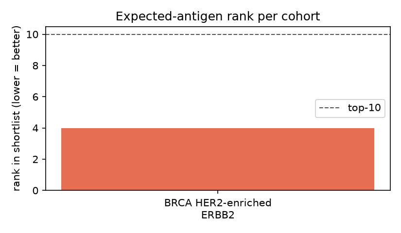
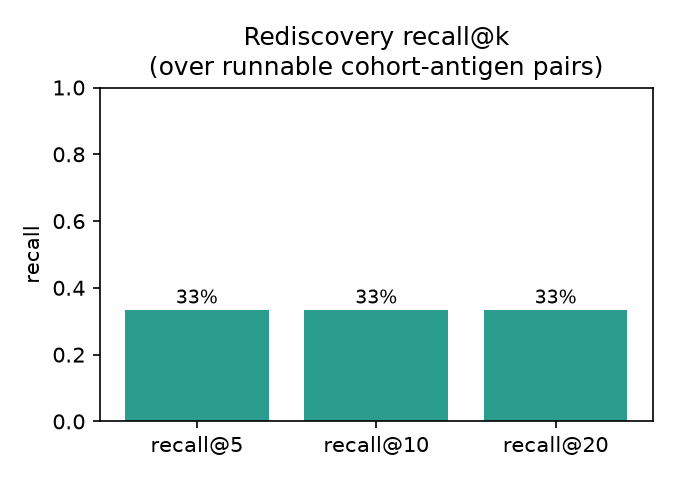
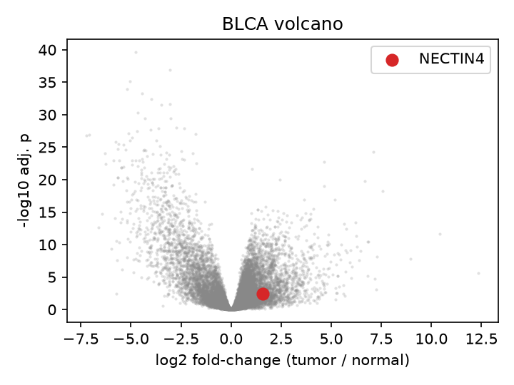
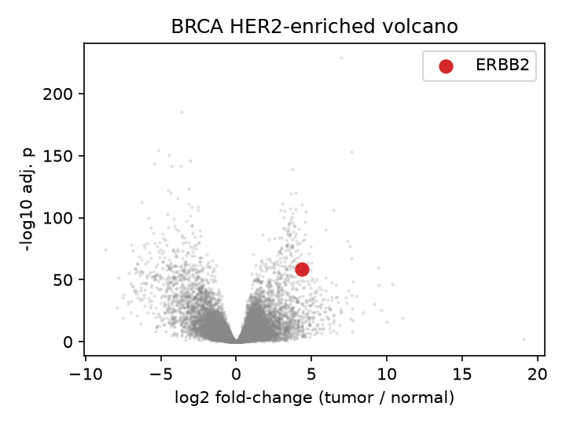
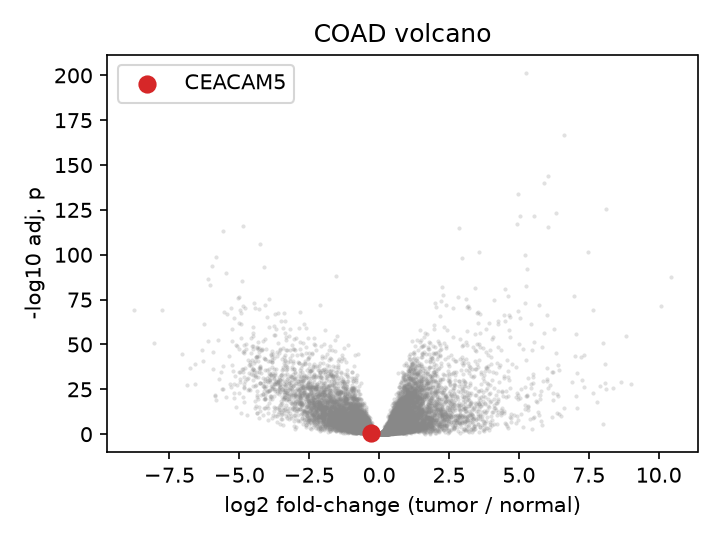
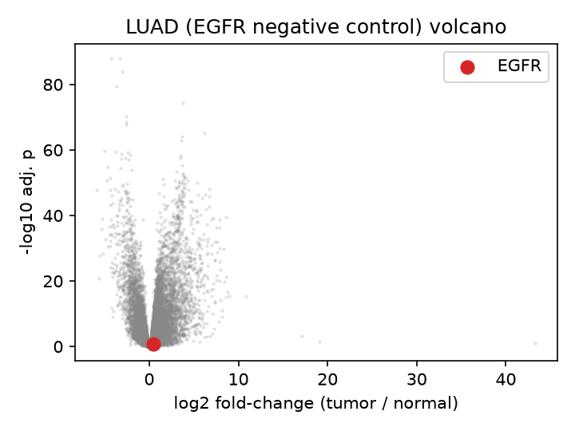
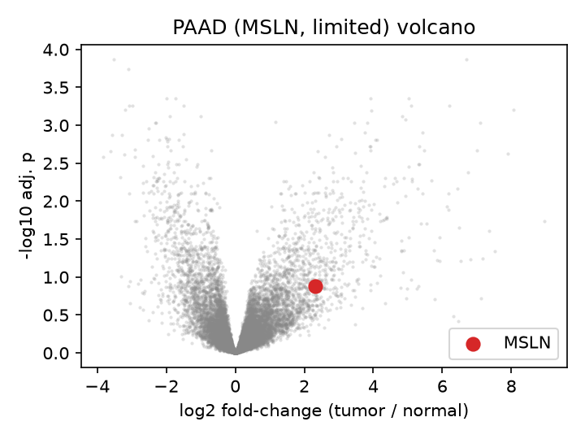
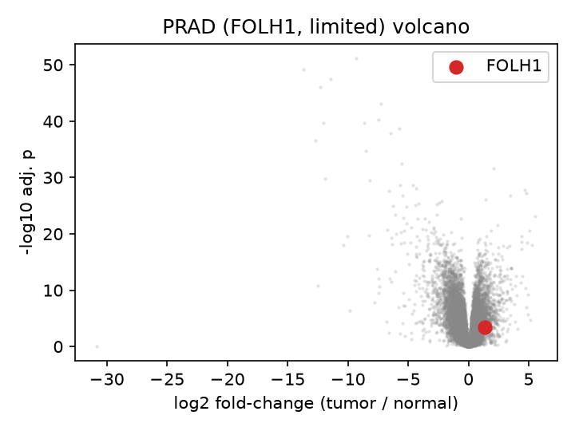

<!-- Generated by scripts/build_docs_results.py — do not edit by hand. -->

# Real results

Everything on this page is read straight from `benchmarks/` in the
repository — the same files the paper and the README cite. Nothing here is
illustrative, recomputed on the fly, or hand-typed.

## Does it rediscover antigens we already trust?

Six real TCGA cohorts were run through the discovery half as
tumor-vs-adjacent-normal contrasts, then scored by where each
clinically-validated antigen landed in the candidate shortlist.

!!! note "How these are grouped"
    Antigens are grouped by their **measured** differential expression
    (FDR&nbsp;<&nbsp;0.05 and log2fc&nbsp;≥&nbsp;1.0), not by clinical fame.
    An expression-based method can only surface what is actually
    over-expressed, and the benchmark reports that precondition openly.

<div class="bs-stats">
<div class="bs-stat"><div class="v">rank 4</div><div class="k">ERBB2 rediscovered</div><div class="d">BRCA HER2-enriched</div></div>
<div class="bs-stat"><div class="v">log2fc 4.36</div><div class="k">fold-change</div><div class="d">padj 1.7e-59</div></div>
<div class="bs-stat"><div class="v">33%</div><div class="k">recall@5</div><div class="d">over over-expressed antigens</div></div>
<div class="bs-stat"><div class="v">33%</div><div class="k">recall@20</div><div class="d">over over-expressed antigens</div></div>
<div class="bs-stat"><div class="v">2/2</div><div class="k">consistency check</div><div class="d">not-over-expressed antigens excluded by construction</div></div>
</div>

| antigen | cohort | over-expressed | log2fc | padj | rank |
|---|---|:--:|--:|--:|--:|
| **ERBB2** | BRCA HER2-enriched | ✓ | 4.36 | 1.7e-59 | 4 |
| **CEACAM5** | COAD | · | -0.31 | 1.9e-01 | — |
| **NECTIN4** | BLCA | ✓ | 1.59 | 3.9e-03 | — |
| **EGFR** | LUAD (EGFR negative control) | · | 0.42 | 1.3e-01 | — |
| **MSLN** | PAAD (MSLN, limited) | · | 2.31 | 1.3e-01 | — |
| **FOLH1** | PRAD (FOLH1, limited) | ✓ | 1.32 | 3.4e-04 | — |

`rank` is the antigen's position in that cohort's shortlist; — = not surfaced.

??? note "Why each cohort behaves the way it does"

    - **ERBB2** (TCGA-BRCA) — PAM50 HER2-enriched tumors are ERBB2-amplified, so ERBB2 mRNA is high.
    - **CEACAM5** (TCGA-COAD) — CEA (target of tusamitamab ravtansine / labetuzumab govitecan) is a classic colorectal marker, but it is also abundantly expressed in normal colon epithelium, so the bulk tumor-vs-adjacent-normal fold-change is ~0.
    - **NECTIN4** (TCGA-BLCA) — Nectin-4 (target of enfortumab vedotin, Padcev) is elevated in urothelial carcinoma, but only modestly at the bulk-mRNA level (log2fc ~1.6), below the discovery shortlist.
    - **EGFR** (TCGA-LUAD) — EGFR drives LUAD via mutation/amplification, not bulk mRNA over-expression, so a specificity-respecting pipeline should NOT surface it on expression alone.
    - **MSLN** (TCGA-PAAD) — Mesothelin is over-expressed in PDAC, but TCGA-PAAD ships only 4 matched normals, so the contrast is underpowered (reported for transparency).
    - **FOLH1** (TCGA-PRAD) — PSMA (FOLH1) is highly expressed but also abundant in normal prostate, so the tumor-vs-normal fold-change is modest (reported for transparency).

??? info "Antigens excluded for data reasons"

    - **CLDN6** (TCGA-OV) — TCGA-OV ships 0 solid-tissue-normal RNA-seq samples; a clean tumor-vs-normal contrast is impossible without an external (GTEx) normal, which would introduce a cross-study batch confound.
    - **CD33 / IL3RA (CD123)** (TCGA-LAML) — TCGA-LAML ships 0 solid-tissue-normal samples; an AML-vs-normal contrast needs a normal haematopoietic reference (e.g. GTEx whole blood / normal bone marrow), again a cross-study batch confound.


*Where each known antigen ranked in its cohort.*


*Recall at k over the over-expressed antigens.*

### Differential expression by cohort

??? abstract "BLCA"

    

??? abstract "BRCA HER2"

    

??? abstract "COAD"

    

??? abstract "LUAD"

    

??? abstract "PAAD"

    

??? abstract "PRAD"

    

## The binders it actually designed

A **real GPU run**, not a simulation — backend `kaggle`, GPU `Tesla P100-16GB (Kaggle free)`, validator `boltz2`, bindsight `0.2.0`, 2026-06-25.

!!! warning "Provisional — these figures predate the target-chain fix"

    This run invoked ProteinMPNN without `--pdb_path_chains`, so the sequence
    designer was free to rewrite the antigen as well as the binder: the binders
    were optimised against a partly-invented ERBB2 surface and then scored against
    the native one. The measurements below are honest — they simply measure a
    mis-configured protocol, so treat them as provisional. Fixed in v0.2.1; these
    numbers will be superseded by a corrected re-run.

**Target:** ERBB2 domain IV (UniProt P04626, residues 511-652; trastuzumab epitope)

<div class="bs-stats">
<div class="bs-stat"><div class="v">20</div><div class="k">designs</div><div class="d">RFdiffusion → ProteinMPNN → Boltz-2</div></div>
<div class="bs-stat"><div class="v">0.84</div><div class="k">best ipTM</div><div class="d">design binder_2_seq1</div></div>
<div class="bs-stat"><div class="v">50%</div><div class="k">success @ ipTM 0.65</div><div class="d">standard criterion</div></div>
<div class="bs-stat"><div class="v">13.7 Å</div><div class="k">mean PAE-int</div><div class="d">lower is more confident</div></div>
</div>

The real Boltz-2 predicted complex behind every ipTM below is committed
alongside its metrics. Rotate them in 3-D on the
[live app](https://huggingface.co/spaces/Mikhaeelatefrizk/bindsight) → **Real results**.

| design | ipTM | PAE-int (Å) | developability | length | instability |
|---|--:|--:|--:|--:|--:|
| `binder_2_seq1` | 0.840 | 7.5 | 0.47 | 86 | 68.8 |
| `binder_4_seq1` | 0.783 | 8.8 | 0.81 | 74 | 37.2 |
| `binder_2_seq0` | 0.776 | 8.8 | 0.56 | 86 | 37.2 |
| `binder_7_seq0` | 0.748 | 11.1 | 0.67 | 50 | 30.1 |
| `binder_1_seq1` | 0.742 | 8.2 | 0.53 | 80 | 77.5 |
| `binder_6_seq1` | 0.741 | 10.3 | 0.53 | 62 | 35.3 |
| `binder_8_seq1` | 0.741 | 10.5 | 0.69 | 85 | 44.3 |
| `binder_9_seq1` | 0.727 | 9.9 | 0.89 | 60 | 31.6 |
| `binder_5_seq1` | 0.689 | 11.1 | 0.78 | 85 | 40.1 |
| `binder_0_seq0` | 0.688 | 10.5 | 0.58 | 91 | 52.2 |
| `binder_3_seq1` | 0.638 | 11.7 | 0.93 | 52 | 33.7 |
| `binder_3_seq0` | 0.592 | 12.3 | 0.54 | 52 | 99.5 |
| `binder_7_seq1` | 0.566 | 14.4 | 0.65 | 50 | 30.4 |
| `binder_8_seq0` | 0.490 | 18.3 | 0.45 | 85 | 56.1 |
| `binder_6_seq0` | 0.488 | 15.4 | 0.57 | 62 | 45.0 |
| `binder_1_seq0` | 0.465 | 16.5 | 0.57 | 80 | 68.1 |
| `binder_5_seq0` | 0.307 | 20.6 | 0.80 | 85 | 34.5 |
| `binder_4_seq0` | 0.244 | 22.5 | 0.74 | 74 | 45.2 |
| `binder_0_seq1` | 0.233 | 22.3 | 0.63 | 91 | 20.2 |
| `binder_9_seq0` | 0.201 | 22.9 | 0.61 | 60 | 81.9 |

## Reproduce it

```bash
pip install -e ".[discover,report]"
python benchmarks/run_validation.py            # rediscovery
python benchmarks/designer_benchmark/score_run.py   # designer benchmark
```

Full write-ups, including the caveats, live in
[`benchmarks/validation/RESULTS.md`](https://github.com/mikhaeelatefrizk/bindsight/blob/main/benchmarks/validation/RESULTS.md)
and
[`benchmarks/designer_benchmark/RESULTS.md`](https://github.com/mikhaeelatefrizk/bindsight/blob/main/benchmarks/designer_benchmark/RESULTS.md).
