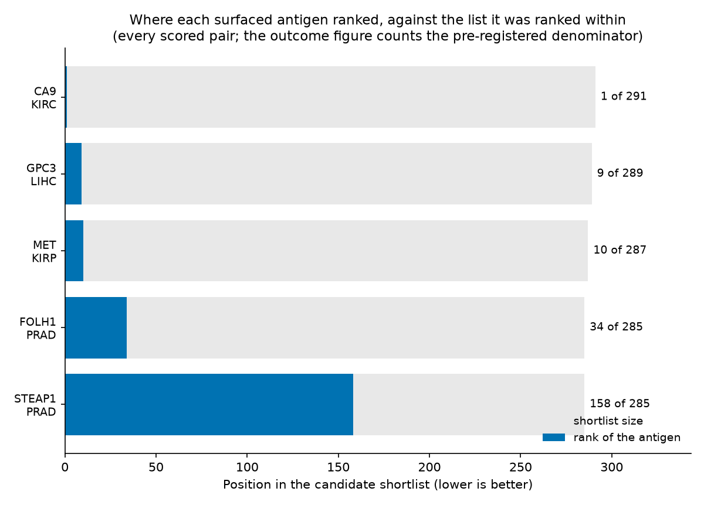
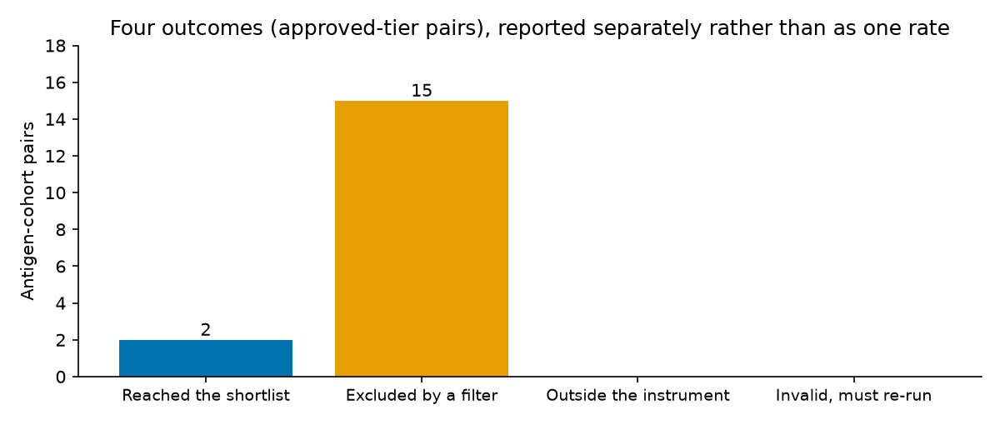

<!-- Generated by scripts/build_docs_results.py — do not edit by hand. -->

# Real results

Everything on this page is read straight from `benchmarks/` in the
repository — the same files the paper and the README cite. Nothing here is
illustrative, recomputed on the fly, or hand-typed.

## Does it rediscover antigens we already trust?

**22 antigen-cohort pairs across 15 real TCGA projects.** Each cohort is a whole, unstratified project — every primary tumour against every solid-tissue normal — with the contrast paired on the patient. Nothing selects for the antigen being sought.

The earlier version of this study did select for it: it chose breast tumours by a subtype classifier built on fifty genes, one of them ERBB2, and then reported discovering ERBB2. The numbers below are far weaker, and they are the honest ones.

The best-ranked antigen is **CA9** in KIRC, at rank **1 of 291** candidates, with a log2 fold change of 9.58.

### Recall, approved agents only

An absolute cutoff is only comparable between shortlists of similar size, so the median shortlist here is **295** candidates drawn from a surfaceome of 4,801 accessions.

| Cutoff | Surfaced | 95% CI |
|---|--:|---|
| recall@5 | 0/17 | 0.000–0.184 |
| recall@10 | 1/17 | 0.010–0.270 |
| recall@20 | 1/17 | 0.010–0.270 |
| recall@50 | 2/17 | 0.033–0.343 |
| recall@100 | 2/17 | 0.033–0.343 |

### Sensitivity to the regulatory tier

The headline counts only antigens whose targeting agent is approved. That excludes CA9 and GPC3, whose evidence is strong and whose agents are not yet licensed. Widening the panel is reported separately rather than folded in, because choosing a denominator after seeing the data is what made the earlier study untrustworthy.

| Cutoff | Every scored pair |
|---|--:|
| recall@5 | 1/22 |
| recall@10 | 3/22 |
| recall@20 | 3/22 |
| recall@50 | 4/22 |
| recall@100 | 4/22 |

### Is the ranking doing anything? Two nulls, pointing different ways

Both are reported because reporting only the flattering one would make the other the finding.

**Against matched decoys — negative.** Each antigen is compared with genes matched to it on abundance and dispersion quintile, drawn from the same eligible surfaceome and ranked by the same counterfactual score: would a gene that merely *looks* like this antigen have ranked as well? Of 22 pairs, **3 are nominally significant at 0.05 and 0 survive Benjamini-Hochberg** across the panel. Against background matched this way, no antigen here is distinguishable once the panel is corrected for its own size.

Read that with the panel's resolution in mind. Each pair's p is bounded below by the size of its own decoy stratum, so the smallest BH-adjusted value this panel could have produced is **0.022** — under 0.05, so a pair genuinely could have survived, but only one sitting essentially on its floor. The negative is a measurement, not a foregone conclusion; it is also not a sensitive one.

**Against a permuted indication — positive.** A narrower panel than the decoy null above, ranked in the cancer each antigen is actually used in against a permuted assignment to the other cohorts. This asks a different question: not whether any single antigen beats its lookalikes, but whether the ordering knows which disease it is looking at.

- Computed over **7 antigens** of the 22 pairs above, across 15 cohorts — those carrying a single indication. The test assigns one cohort per antigen, so an antigen licensed in several cancers has no single correct one to permute and cannot enter it
- Observed mean standing **0.858**, where 1.0 is the top of the eligible surfaceome and 0.0 the bottom
- p = **3.97e-04** over 5040 enumerated permutations — the floor for this many permutations, so it is as extreme as an exhaustive enumeration of this panel can show rather than vanishingly small
- Within-antigen difference **0.348** (95% CI 0.188–0.513) between an antigen's standing in its own indication and in cohorts carrying no panel antigen — each antigen is its own control, and the interval excludes zero

This is the strongest claim the study supports, and it is a claim about the ordering, not about any individual hit.

### Four outcomes, never merged

An antigen the surfaceome reference does not contain, one a stated filter excluded, one the ranking placed low, and one whose lookup failed are four different findings about four different parts of the system. The first column is the pre-registered approved-agent denominator; the second is every scored pair, matching the table below.

| Outcome | Approved agents | Every scored pair |
|---|--:|--:|
| Reached the shortlist | 2 | 5 |
| Excluded by a stated filter | 15 | 17 |
| Outside the instrument's reach | 0 | 0 |
| Invalid, must be re-run | 0 | 0 |

### Every pair

| Antigen | Cohort | log2FC | padj | Rank | Counterfactual rank | Why |
|---|---|--:|--:|--:|--:|---|
| **CA9** | KIRC | 9.58 | 0.00e+00 | 1 of 291 | 1 of 3727 | reached the candidate shortlist at rank 1 of 291 (carried through to design) |
| **GPC3** | LIHC | 3.97 | 8.17e-33 | 9 of 289 | 9 of 3510 | reached the candidate shortlist at rank 9 of 289 (carried through to design) |
| **MET** | KIRP | 2.34 | 8.39e-58 | 10 of 287 | 10 of 3674 | reached the candidate shortlist at rank 10 of 287 (carried through to design) |
| **FOLH1** | PRAD | 2.21 | 2.35e-15 | 34 of 285 | 36 of 3710 | reached the candidate shortlist at rank 34 of 285 (past the structure-fetch cap; no lookup was attempted) |
| **STEAP1** | PRAD | 1.14 | 1.13e-06 | 158 of 285 | 244 of 3710 | reached the candidate shortlist at rank 158 of 285 (past the structure-fetch cap; no lookup was attempted) |
| **CEACAM5** | COAD | -0.48 | 4.52e-02 | — | 1753 of 3582 | did not clear the significance rule, which requires BOTH an adjusted p-value below the FDR threshold AND an absolute log2 fold change at or above the floor — naming only the FDR would misattribute an antigen that is statistically solid but modestly changed, such as ERBB2 in the unstratified breast cohort at log2fc 0.92 |
| **CLDN18** | ESCA | -0.39 | 6.93e-01 | — | 2265 of 3748 | did not clear the significance rule, which requires BOTH an adjusted p-value below the FDR threshold AND an absolute log2 fold change at or above the floor — naming only the FDR would misattribute an antigen that is statistically solid but modestly changed, such as ERBB2 in the unstratified breast cohort at log2fc 0.92 |
| **CLDN18** | STAD | -0.06 | 9.31e-01 | — | 1835 of 3799 | did not clear the significance rule, which requires BOTH an adjusted p-value below the FDR threshold AND an absolute log2 fold change at or above the floor — naming only the FDR would misattribute an antigen that is statistically solid but modestly changed, such as ERBB2 in the unstratified breast cohort at log2fc 0.92 |
| **EGFR** | COAD | -1.04 | 3.46e-14 | — | 2715 of 3582 | measured as down-regulated in tumour |
| **EGFR** | HNSC | 1.03 | 2.88e-07 | — | 413 of 3671 | outside the top-K enrichment cut, so it never became a candidate at all (this is a gate, not a ranking outcome) |
| **EGFR** | LUAD | 0.06 | 7.55e-01 | — | 1443 of 3761 | did not clear the significance rule, which requires BOTH an adjusted p-value below the FDR threshold AND an absolute log2 fold change at or above the floor — naming only the FDR would misattribute an antigen that is statistically solid but modestly changed, such as ERBB2 in the unstratified breast cohort at log2fc 0.92 |
| **EGFR** | LUSC | 1.07 | 1.43e-06 | — | 648 of 3771 | outside the top-K enrichment cut, so it never became a candidate at all (this is a gate, not a ranking outcome) |
| **ERBB2** | BRCA | 0.92 | 5.64e-11 | — | 476 of 3817 | did not clear the significance rule, which requires BOTH an adjusted p-value below the FDR threshold AND an absolute log2 fold change at or above the floor — naming only the FDR would misattribute an antigen that is statistically solid but modestly changed, such as ERBB2 in the unstratified breast cohort at log2fc 0.92 |
| **ERBB2** | LUAD | 0.41 | 1.35e-03 | — | 841 of 3761 | did not clear the significance rule, which requires BOTH an adjusted p-value below the FDR threshold AND an absolute log2 fold change at or above the floor — naming only the FDR would misattribute an antigen that is statistically solid but modestly changed, such as ERBB2 in the unstratified breast cohort at log2fc 0.92 |
| **ERBB2** | STAD | 0.44 | 1.52e-01 | — | 997 of 3799 | did not clear the significance rule, which requires BOTH an adjusted p-value below the FDR threshold AND an absolute log2 fold change at or above the floor — naming only the FDR would misattribute an antigen that is statistically solid but modestly changed, such as ERBB2 in the unstratified breast cohort at log2fc 0.92 |
| **ERBB2** | UCEC | 0.48 | 3.17e-02 | — | 937 of 3631 | did not clear the significance rule, which requires BOTH an adjusted p-value below the FDR threshold AND an absolute log2 fold change at or above the floor — naming only the FDR would misattribute an antigen that is statistically solid but modestly changed, such as ERBB2 in the unstratified breast cohort at log2fc 0.92 |
| **FGFR2** | STAD | -0.33 | 2.79e-01 | — | 2333 of 3799 | did not clear the significance rule, which requires BOTH an adjusted p-value below the FDR threshold AND an absolute log2 fold change at or above the floor — naming only the FDR would misattribute an antigen that is statistically solid but modestly changed, such as ERBB2 in the unstratified breast cohort at log2fc 0.92 |
| **FOLR1** | UCEC | 1.51 | 2.21e-02 | — | 669 of 3631 | outside the top-K enrichment cut, so it never became a candidate at all (this is a gate, not a ranking outcome) |
| **MET** | LUAD | 0.67 | 6.57e-04 | — | 713 of 3761 | did not clear the significance rule, which requires BOTH an adjusted p-value below the FDR threshold AND an absolute log2 fold change at or above the floor — naming only the FDR would misattribute an antigen that is statistically solid but modestly changed, such as ERBB2 in the unstratified breast cohort at log2fc 0.92 |
| **NECTIN4** | BLCA | 1.52 | 5.26e-02 | — | 438 of 3576 | did not clear the significance rule, which requires BOTH an adjusted p-value below the FDR threshold AND an absolute log2 fold change at or above the floor — naming only the FDR would misattribute an antigen that is statistically solid but modestly changed, such as ERBB2 in the unstratified breast cohort at log2fc 0.92 |
| **TACSTD2** | BRCA | 0.16 | 3.63e-01 | — | 1375 of 3817 | did not clear the significance rule, which requires BOTH an adjusted p-value below the FDR threshold AND an absolute log2 fold change at or above the floor — naming only the FDR would misattribute an antigen that is statistically solid but modestly changed, such as ERBB2 in the unstratified breast cohort at log2fc 0.92 |
| **TACSTD2** | LUAD | 0.15 | 3.56e-01 | — | 1286 of 3761 | did not clear the significance rule, which requires BOTH an adjusted p-value below the FDR threshold AND an absolute log2 fold change at or above the floor — naming only the FDR would misattribute an antigen that is statistically solid but modestly changed, such as ERBB2 in the unstratified breast cohort at log2fc 0.92 |

### Antigens the instrument could not see

CA9 (Q16790) and STEAP1 (Q9UHE8) are absent from the SURFY surfaceome list — verified against both the vendored file and the upstream one, so a genuine reference gap rather than a build error. Under SURFY alone neither could enter the candidate table at any expression level, and CA9 measures a log2 fold change of 9.58 in clear-cell kidney, the largest effect anywhere in this panel. That is an instrument-coverage failure, not a ranking failure, and the fix was a better instrument: the extended reference adds UniProt's curated cell-membrane annotations, 1,915 further accessions, and makes both reachable. Runs with `use_extended_surfaceome=False` reproduce the SURFY-only behaviour, under which these two are still reported as unreachable rather than as misses.



*Where each surfaced antigen ranked, drawn against the shortlist it was ranked within.*



*The four outcomes, reported separately. Collapsing them into one recall number is what made the previous page misleading.*

## The binders it actually designed

A **real GPU run**, not a simulation — backend `kaggle`, GPU `Tesla T4-16GB (Kaggle free)`, validator `boltz2`, bindsight `0.2.2`, 2026-09-07.

!!! success "The target was held fixed, and that is checked"

    An earlier run invoked ProteinMPNN without `--pdb_path_chains`, so the
    sequence designer rewrote the antigen as well as the binder: those binders
    were optimised against a partly-invented ERBB2 surface and then scored
    against the native one. Its figures — best ipTM 0.84, 50% success — are
    withdrawn.

    The run below uses the corrected protocol, and every design carries a
    target chain byte-identical to the native 142-residue domain IV. The
    corrected mean ipTM is 0.51 against the superseded 0.59, but the two are not distinguishable at this size: the interval on this mean is 0.40–0.62 and 0.59 falls inside it.
    The protocol correction rests on the chain-identity check below, not
    on the means moving. The best single design is 0.88.

**Target:** ERBB2

<div class="bs-stats">
<div class="bs-stat"><div class="v">20</div><div class="k">designs</div><div class="d">RFdiffusion → ProteinMPNN → Boltz-2</div></div>
<div class="bs-stat"><div class="v">0.88</div><div class="k">best ipTM</div><div class="d">design P04626_binder_0_seq1</div></div>
<div class="bs-stat"><div class="v">40%</div><div class="k">success @ ipTM 0.65</div><div class="d">95% CI 15–70% over backbones — withdrawn as a measure of design quality</div></div>
<div class="bs-stat"><div class="v">15.6 Å</div><div class="k">mean PAE-int</div><div class="d">lower is more confident</div></div>
</div>

The real Boltz-2 predicted complex behind every ipTM below is committed
alongside its metrics. Rotate them in 3-D with `bindsight ui`
→ **Evidence** → *The complexes themselves*.

| design | ipTM | PAE-int (Å) | developability | length | instability |
|---|--:|--:|--:|--:|--:|
| `P04626_binder_0_seq1` | 0.881 | 8.0 | 0.39 | 75 | 113.7 |
| `P04626_binder_9_seq1` | 0.839 | 8.0 | 0.61 | 89 | 28.9 |
| `P04626_binder_3_seq0` | 0.785 | 6.9 | 0.69 | 66 | 44.3 |
| `P04626_binder_4_seq0` | 0.756 | 9.5 | 0.86 | 62 | 37.6 |
| `P04626_binder_9_seq0` | 0.744 | 9.4 | 0.72 | 89 | 40.1 |
| `P04626_binder_0_seq0` | 0.712 | 12.8 | 0.75 | 75 | 52.0 |
| `P04626_binder_1_seq0` | 0.706 | 9.6 | 0.76 | 57 | 45.5 |
| `P04626_binder_1_seq1` | 0.702 | 10.4 | 0.60 | 57 | 34.9 |
| `P04626_binder_3_seq1` | 0.636 | 10.9 | 0.53 | 66 | 51.2 |
| `P04626_binder_2_seq1` | 0.590 | 13.6 | 0.67 | 54 | 47.5 |
| `P04626_binder_5_seq1` | 0.393 | 18.6 | 0.56 | 73 | 28.0 |
| `P04626_binder_6_seq1` | 0.384 | 18.2 | 0.41 | 51 | 10.7 |
| `P04626_binder_7_seq1` | 0.355 | 17.5 | 0.45 | 53 | 27.9 |
| `P04626_binder_6_seq0` | 0.344 | 20.0 | 0.94 | 51 | -16.8 |
| `P04626_binder_8_seq1` | 0.340 | 20.5 | 0.79 | 80 | 56.6 |
| `P04626_binder_4_seq1` | 0.250 | 22.2 | 0.77 | 62 | -1.1 |
| `P04626_binder_7_seq0` | 0.215 | 22.4 | 0.43 | 53 | 11.8 |
| `P04626_binder_2_seq0` | 0.210 | 23.2 | 0.79 | 54 | 35.4 |
| `P04626_binder_8_seq0` | 0.188 | 24.1 | 0.53 | 80 | -0.2 |
| `P04626_binder_5_seq0` | 0.125 | 25.6 | 0.59 | 73 | 30.6 |

## Reproduce it

Three tiers, because they cost very different things. Start at the top:
everything on this page is rendered from committed files, so the first
tier reproduces the page itself without a network connection.

**1. Regenerate this page from the committed artifacts — offline, seconds.**

```bash
git clone https://github.com/mikhaeelatefrizk/bindsight
cd bindsight
pip install -e ".[discover,report]"
python scripts/build_docs_results.py   # rewrites this page; it should not change
```

**2. Re-run the rediscovery study — needs network, a few CPU-hours.**

The cohorts are downloaded from NIH/GDC on first use and cached under
`data/gdc_cache/`, which is not committed; the download is the slow part.

```bash
python benchmarks/run_study.py --all --cpus 2   # fetches + runs DESeq2
python benchmarks/run_study.py --score-only     # re-scores what is already on disk
```

**3. Re-run the binder design — needs a GPU.**

`score_run.py` is a scorer, not a runner: it takes the archive that a GPU run
produces. The full three-step chain, including preparing the target, is in
[`RUN_FREE_GPU.md`](https://github.com/mikhaeelatefrizk/bindsight/blob/main/benchmarks/designer_benchmark/RUN_FREE_GPU.md),
which runs on a free Kaggle T4.

```bash
python benchmarks/designer_benchmark/prepare_erbb2_target.py
python benchmarks/run_designer_benchmark.py --backend kaggle \
    --designers rfdiff_mpnn --trajectories 10 \
    --structures-dir data/target_structures \
    --out benchmarks/designer_benchmark/run
python benchmarks/designer_benchmark/score_run.py <out_dir>/<id>.tar.gz \
    --n-trajectories 10 --out benchmarks/designer_benchmark
```

Full write-ups, including the caveats, live in
[`benchmarks/study/RESULTS.md`](https://github.com/mikhaeelatefrizk/bindsight/blob/main/benchmarks/study/RESULTS.md)
and
[`benchmarks/designer_benchmark/RESULTS.md`](https://github.com/mikhaeelatefrizk/bindsight/blob/main/benchmarks/designer_benchmark/RESULTS.md).
